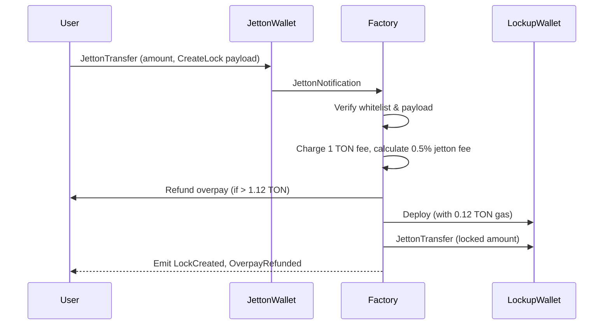
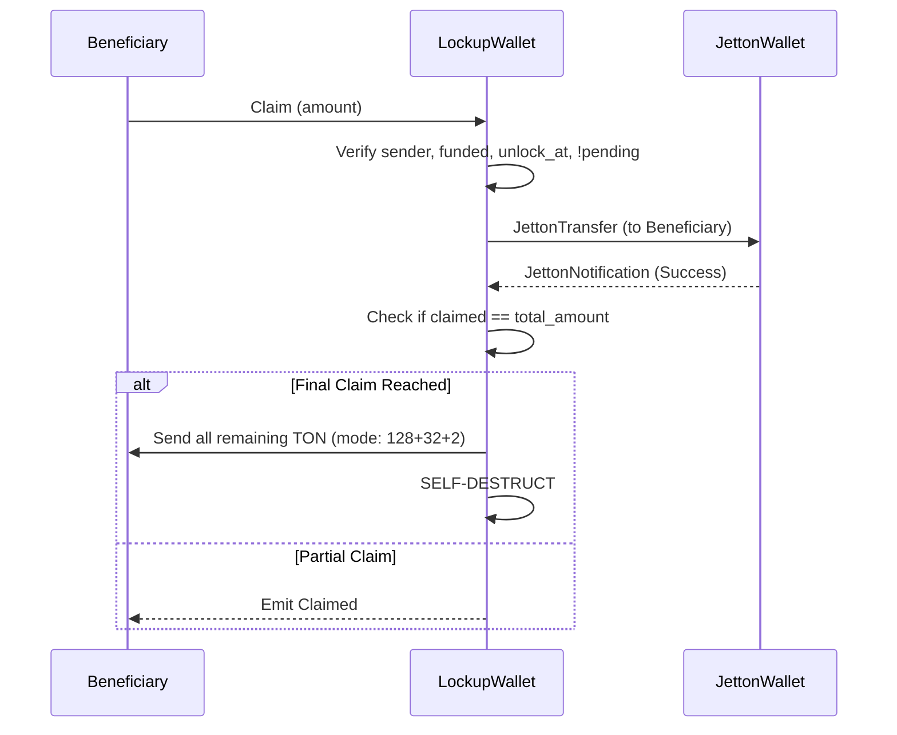

# 📜 NEURON Vesting — Contract Specification

**Version:** `v5.0.0`  
**Status:** Internal review passed · 51 sandbox tests green · external audit planned before third-party onboarding  
**Language:** Tact 1.6.13  
**Network:** TON Mainnet  

---

## 📑 Table of Contents
1. [Overview](#1-overview)
2. [Contract: LockupFactory](#2-contract-lockupfactory)
3. [Contract: LockupWallet](#3-contract-lockupwallet)
4. [Message Types & Opcodes](#4-message-types--opcodes)
5. [Events](#5-events)
6. [Constants](#6-constants)
7. [Invariants](#7-invariants)
8. [Known Limitations](#8-known-limitations)
9. [Trust Model](#9-trust-model)
10. [Sequence Diagrams](#10-sequence-diagrams)

---

## 1. Overview
NEURON Vesting is a non-custodial, immutable token lockup system on TON. Users lock TEP-74 jettons with a transparent schedule. Locked tokens cannot be withdrawn until the `unlock_at` timestamp. 

**Key v5.0.0 Feature:** Upon the final claim, the `LockupWallet` automatically sweeps all remaining TON to the beneficiary and self-destructs (`mode: 128 + 32 + 2`), reclaiming storage deposit and leaving zero dead dust.

### Components
- **`LockupFactory`**: Singleton. Receives jetton transfers, deploys `LockupWallet` instances, forwards jettons, and accumulates platform fees.
- **`LockupWallet`**: Ephemeral contract (one per lock). Holds jettons, enforces the schedule, releases to the beneficiary, and self-destructs upon completion.
- **`messages.tact`**: Shared TEP-74 / TEP-89 message declarations.

---

## 2. Contract: LockupFactory

### State
| Field | Type | Description |
| :--- | :--- | :--- |
| `next_id` | `Int as uint64` | Monotonic lock counter, starts at 1 |
| `treasury` | `Address` | Platform treasury (fee recipient, whitelist authority) |
| `own_wallets` | `map<Address, Address>` | `jetton_master` → factory jetton wallet |
| `wallet_to_master`| `map<Address, Address>` | factory jetton wallet → `jetton_master` |
| `fees` | `map<Address, Int>` | `jetton_master` → accumulated jetton fee (0.5%) |
| `ton_fees` | `Int as coins` | Accumulated TON platform fees (1 TON per lock) |
| `pending_withdraw`| `map<Int, Int>` | `query_id` → pending jetton fee withdrawal amount |
| `pending_jetton` | `map<Int, Address>`| `query_id` → pending jetton master |
| `used_qids` | `map<Int, Bool>` | Monotonic `query_id` registry to prevent replay |
| `pending_create` | `map<Int, Address>` | `lock_id` → child `LockupWallet` address |
| `create_*` | `map<Int, ...>` | Temporary state for bounce recovery (creator, amount, beneficiary, jetton) |

### Receivers
#### `SetJettonWallet` (Treasury only)
Registers a factory-owned jetton wallet for a given master.
- **Preconditions:** `sender() == treasury`, `query_id > 0`, `own_wallets[jetton_master]` is unset OR equals `jetton_wallet`.
- **Effects:** Updates `own_wallets` and `wallet_to_master`. Emits `JettonWalletSet`.
- **Security:** Off-chain verifier (`scripts/verify-jetton-wallets.ts`) validates the address against the master's `get_wallet_address` before the call.

#### `JettonNotification` (Any user, via whitelisted jetton wallet)
Main entry point for lock creation.
- **Preconditions:** 
  - `wallet_to_master[sender()] != null`
  - `context().value >= 1.12 TON` (1 TON fee + 0.12 TON gas buffer)
  - `forward_payload` parses as `CreateLock` and matches the master
  - `unlock_at > now()` and `unlock_at <= now() + 10 years`
  - `lock_amount = amount - 0.5% fee > 0`
- **Effects:** 
  - Charges `ton_fees += 1 TON`, refunds overpay to `msg.sender`.
  - Adds 0.5% to `fees[jetton_master]`.
  - Deploys `LockupWallet` with `total_amount = amount - fee`.
  - Forwards jettons to `LockupWallet`.
  - Records `pending_create` and `create_*` for bounce recovery.
  - Emits `LockCreated`, `TonFeeCollected`.

#### `WithdrawFees` / `WithdrawTonFees` (Treasury only)
- **Preconditions:** `sender() == treasury`, `query_id > 0`, `qid` not used, sufficient balance.
- **Effects:** Reserves `query_id`, deducts fees, sends `JettonTransfer` or TON to destination. On bounce: restores fees, emits `WithdrawBounced`.

#### `bounced<JettonTransfer>`
Handles two cases, disambiguated by `query_id` namespace:
1. **Create-transfer bounce:** Matches `pending_create[qid]`. Verifies sender, refunds jettons to creator, emits `CreateBounced` + `LockCreationFailed`, clears pending maps. *(v5.0.0: Refund now includes both platform fee and gas buffer).*
2. **Fee-withdrawal bounce:** Matches `pending_withdraw[qid]`. Verifies sender, restores `fees[master]`, emits `WithdrawBounced`.

---

## 3. Contract: LockupWallet

### State
| Field | Type | Description |
| :--- | :--- | :--- |
| `lock_id` | `Int as uint64` | Unique lock id |
| `factory` | `Address` | Factory that deployed this wallet |
| `jetton_master` | `Address` | Jetton master of locked tokens |
| `jetton_wallet` | `Address` | This wallet's jetton wallet address |
| `beneficiary` | `Address` | Who can claim after unlock |
| `creator` | `Address` | Original jetton owner; can extend |
| `total_amount` | `Int as coins` | Locked amount (immutable) |
| `claimed` | `Int as coins` | Amount claimed so far |
| `unlock_at` | `Int as uint64` | Unix timestamp when claim becomes available |
| `funded` | `Bool` | True after first correct-amount deposit |
| `pending_claim` | `Bool` | True while a claim transfer is in-flight |
| `pending_query_id`| `Int as uint64` | Query id of the in-flight claim |

### Receivers
#### `JettonNotification`
- **Preconditions:** `sender() == jetton_wallet`
- **Effects:** If `!funded && amount == total_amount` → `funded = true`, emits `LockFunded`. Otherwise emits `UnexpectedDeposit` (deposit accepted but ignored).

#### `Claim`
- **Preconditions:** `sender() == beneficiary`, `funded == true`, `now() >= unlock_at`, `!pending_claim`, `available > 0`.
- **Effects:** Updates `claimed`, sets `pending_*` flags. Sends `JettonTransfer` via `jetton_wallet` targeting beneficiary. Emits `Claimed`. 
- **🔥 v5.0.0 Self-Destruct:** If `claimed + want == total_amount`, the contract sweeps **all remaining TON** to the `beneficiary` and self-destructs (`mode: 128 + 32 + 2`).
- **On bounce:** Rolls back `claimed`, clears `pending_*`, emits `ClaimBounced`.

#### `Extend`
- **Preconditions:** `sender() == creator`, `now() < unlock_at`, `new_unlock_at > unlock_at`, `new_unlock_at <= now() + 10 years`.
- **Effects:** `unlock_at = new_unlock_at`. Emits `Extended`.

#### `ResetPendingClaim`
- **Preconditions:** `sender() == beneficiary`, `pending_claim == true`, `now() >= pending_since + 6 hours`.
- **Effects:** Clears `pending_*`. Does NOT roll back `claimed` (stuck-but-safe trade-off). Emits `PendingClaimReset`.

---

## 4. Message Types & Opcodes

### TEP-74 Standard
| Opcode | Message | Direction |
| :--- | :--- | :--- |
| `0x0f8a7ea5` | `JettonTransfer` | Outgoing |
| `0x7362d09c` | `JettonNotification` | Incoming |

### Platform Control
| Opcode | Message | Sender → Receiver |
| :--- | :--- | :--- |
| `0x21` | `SetJettonWallet` | Treasury → Factory |
| `0x20` | `WithdrawFees` | Treasury → Factory |
| `0x22` | `WithdrawTonFees` | Treasury → Factory |
| `0x10` | `Claim` | Beneficiary → Wallet |
| `0x11` | `Extend` | Creator → Wallet |
| `0x12` | `ResetPendingClaim` | Beneficiary → Wallet |
| `0x01` | `CreateLock` (forward payload) | User → Factory (via jetton transfer) |

---

## 5. Events
*Note: Ranges are disjoint so indexers can route events by opcode.*

### Factory (Range `0x100–0x11F`)
| Opcode | Event | Description |
| :--- | :--- | :--- |
| `0x100` | `LockCreated` | New lock deployed |
| `0x104` | `WithdrawBounced` | Fee withdrawal failed |
| `0x106` | `TonFeeCollected` | 1 TON fee received |
| `0x107` | `FeesWithdrawn` | Jetton fees withdrawn |
| `0x108` | `OverpayRefunded` | Excess TON returned to creator |
| `0x109` | `JettonWalletSet` | New jetton whitelisted |
| `0x110` | `TonFeesWithdrawn` | TON fees withdrawn |
| `0x111` | `LockCreationFailed` | Lock deployment aborted |
| `0x112` | `CreateBounced` | Jetton transfer bounced during creation |

### Wallet (Range `0x124–0x12F`)
| Opcode | Event | Description |
| :--- | :--- | :--- |
| `0x124` | `Claimed` | Successful claim transfer initiated |
| `0x125` | `Extended` | Unlock date pushed forward |
| `0x126` | `ClaimBounced` | Claim transfer failed, accounting rolled back |
| `0x127` | `PendingClaimReset` | Stuck pending claim manually cleared |
| `0x128` | `StaleBounceIgnored` | Unrecognized bounce safely ignored |
| `0x129` | `LockFunded` | Initial jetton deposit confirmed |
| `0x12A` | `UnexpectedDeposit` | Non-matching jetton deposit ignored |

---

## 6. Constants
| Name | Value | Purpose |
| :--- | :--- | :--- |
| `PLATFORM_FEE_TON` | `1 TON` | Per-lock platform fee |
| `GAS_BUFFER_TON` | `0.12 TON` | Minimum gas buffer attached by user |
| `DEPLOY_GAS` | `0.12 TON` | Gas allocated for child wallet deployment |
| `MAX_LOCK_DURATION`| `315,360,000` (10y) | Max unlock horizon from creation |
| `CLAIM_GAS` | `0.05 TON` | Gas allocated for claim transfer |
| `PENDING_TIMEOUT` | `21,600` (6h) | Time before `ResetPendingClaim` is allowed |

---

## 7. Invariants
### Factory (F1–F9)
- **F1:** `next_id` strictly increases, never reused.
- **F2:** `own_wallets[m]` is set ⇔ master `m` is whitelisted.
- **F3:** `wallet_to_master[w] = m` ⇔ `own_wallets[m] = w` (strict bijection).
- **F4:** `fees[m]` = sum of 0.5% cuts − withdrawals.
- **F5:** `pending_withdraw[qid]` and `pending_jetton[qid]` are set/cleared together.
- **F6:** `used_qids` monotonic: once true, never false.
- **F7:** `pending_create[qid]` set at create, cleared on success or bounce.
- **F8:** `ton_fees >= 0` at all times.

### Wallet (I1–I10)
- **I1:** `0 <= claimed <= total_amount`.
- **I2:** `available >= 0`.
- **I3:** At most one claim in-flight (`pending_claim == true`).
- **I4:** `jetton_wallet` is set at deploy time by Factory and is immutable.
- **I5:** Only `beneficiary` can `Claim` or `ResetPendingClaim`.
- **I6:** `creator` can only extend forward, and only while `now() < unlock_at`.
- **I7:** Bounce restores accounting **only** on exact `query_id` match.
- **I8:** `total_amount` is strictly immutable.
- **I9:** `Claim` requires `funded == true`.
- **I10:** 🔥 **v5.0.0:** Upon `claimed == total_amount`, the contract self-destructs and leaves exactly `0` TON balance.

---

## 8. Known Limitations
### Wallet
- **L1:** `ResetPendingClaim` does not roll back `claimed`. This is a stuck-but-safe trade-off to prevent double-claiming if a bounce is delayed.
- **L2:** Non-factory jetton deposits are accepted but ignored (`UnexpectedDeposit`).
- **L3:** No top-ups can extend `total_amount`.

### Factory
- **L1:** Lost fee-withdrawal bounce leaves `pending_withdraw[qid]` set forever (no funds are lost, but the `query_id` is burned).
- **L2:** Overpay refund goes to `msg.sender` (original owner of the jettons).
- **L3:** Create-transfer bounce may leave an empty, unfunded deployed `LockupWallet`. Frontends must filter these out using the `LockCreationFailed` event or `funded == false` getter.

---

## 9. Trust Model
| Party | Trusted for | Cannot do |
| :--- | :--- | :--- |
| **Treasury** | Whitelisting masters, fee withdrawal | Steal locked jettons, modify existing locks |
| **Factory** | Deploy, one-time deposit, overpay refund | Withdraw jettons from `LockupWallet`, reset pending claims |
| **Creator** | Extend unlock date (forward-only, while locked) | Withdraw jettons, shorten unlock, extend after unlock |
| **Beneficiary** | Claim after unlock, reset stuck pending claims | Claim before unlock, claim if not funded |

> **⚠️ Treasury Compromise Impact:** DoS on new lock creation (by registering bad addresses). **No theft of locked jettons is possible.**  
> **Mitigation:** 2-of-3 multisig treasury + off-chain verifier.

---

## 10. Sequence Diagrams

### Create Lock

### Claim (Successful Final Claim with v5.0.0 Self-Destruct)

---
*End of specification. For implementation details, see `contracts/` directory.*
